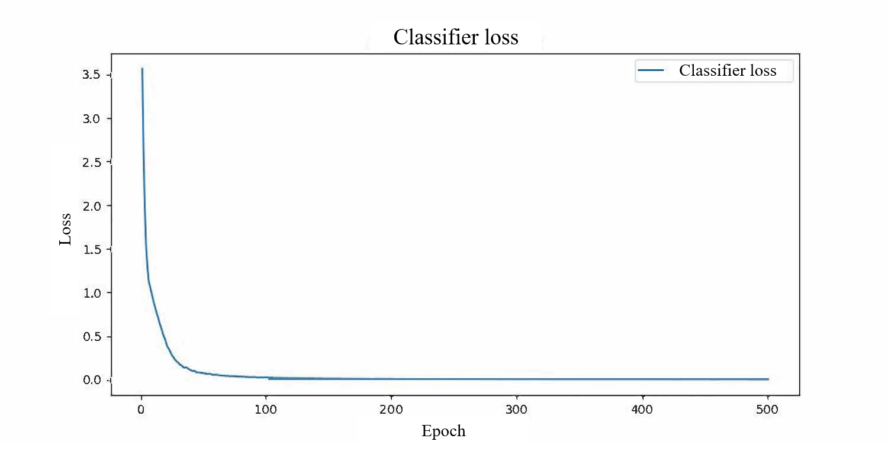

# Global-optimal-semi-supervised-learning-for-single-pixel-image-free-sensing
This network could achieve a semi-supervised end-to-end optimal learning method for single-pixel image-free sensing on part-labelled datasets based on the method reported in the ol-511448.

We utilize a Generative Adversarial Neural network (GAN) as the backbone, consisting of a generator and a discriminator. The generator is responsible for generating pseudo data from random noise, and the discriminator is replaced with a classifier in this work, to accomplish intricate multi-classification tasks. In particular, it takes a 1 × 1 × 100 random vector sampled from a standard normal distribution as input. The input is upsampled from low-dimensional features to high-dimensional features by passing through four unbiased transpose convolutional layers, aligning with the desired dimensions of the pseudo data. To enhance the stability and convergence speed, Batch Normalization (BN) and Rectified Linear Unit (ReLU) non-linear activation functions are performed on the outputs of the first three layers. The classifier receives pseudo images from the generator, as well as a large number of unlabelled and a few labelled data concurrently. First, all input data are coupled to one-dimensional measurements by an unbiased convolutional layer, where the convolutional kernels represent modulation patterns. Second, we employ a lightweight ResNet_18 decoding network, known for its excellent feature extraction capabilities, to directly decouple the one-dimensional measurements without requiring image reconstruction.

During training, we carry out simulations on the MNIST dataset composing of 60,000 images for training and 10,000 images for testing, respectively. Notably, there are only 200 images with their corresponding classification labels for the MNIST dataset. Facing the data source-constrained situation, we can evaluate the efficacy of the proposed global optimization-inspired approach at a 0.1 sampling ratio in a single training step. After servel epoches of training (about 150 epoches, as shown below), the network will have been well trained and we can obtain the optimal patterns.

We have uploaded the complete classifier model file, available in the "./model/" directory. Furthermore, some test examples of the MNIST dataset has been included in the "./test_demo/" folder, and their predictions can be obtained by running the "test.exe" script. Meanwhile, the list of necessary packages can be found in the 'requirements.txt' file.
